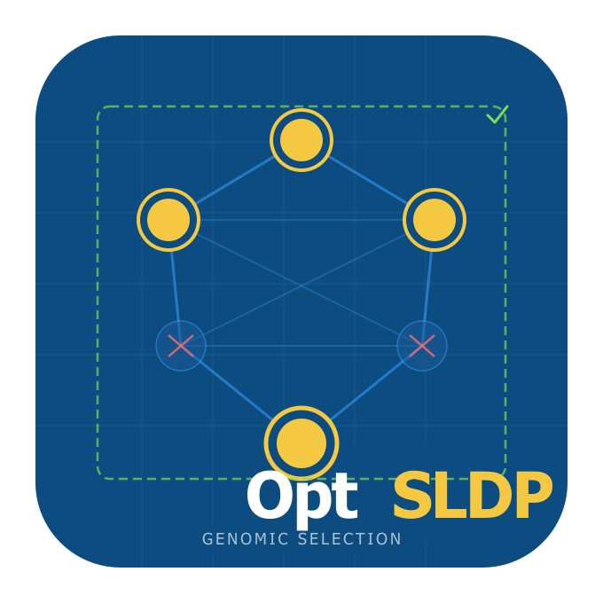

# OptSLDP — An Optimized Selective Linkage Disequilibrium Pruning Pipeline



`OptSLDP` is an **optimized and extended** implementation of Selective
Linkage Disequilibrium Pruning for genomic prediction panel
construction. The core idea of SLDP — preserving all markers in strong
LD with statistically important SNPs so that genomic models retain the
full genetic signal around each QTL, while pruning redundant background
markers — is retained from the original algorithm of Zhu et al. (2023).
OptSLDP improves on that foundation in four concrete ways:

1.  **Memory-safe chunked reading** — genotype files are read in
    fixed-size row chunks with a pre-allocated output matrix, so peak
    RAM is proportional to one chunk rather than twice the full file.

2.  **Explicit per-chromosome garbage collection** — `gc(FALSE)` is
    called after each chromosome’s LD matrix is released in both the
    pre-pruning and background-pruning loops, preventing heap
    fragmentation across 20-30 chromosome passes.

3.  **Multi-trait union protection** — screening and candidate selection
    run independently for each trait; the union of all per-trait
    candidate sets is expanded and protected, so every SNP important for
    *any* trait is retained in the final panel.

4.  **Covariate-adjusted marginal screening** — phenotypes are
    residualised on shared covariates once before the SNP scan
    (equivalent to including covariates in every marginal regression but
    computed in a single [`lm()`](https://rdrr.io/r/stats/lm.html)
    call), which correctly adjusts effect estimates for population
    structure or other confounders.

5.  **Vectorised OLS screening** — marginal regressions use matrix
    algebra (`tcrossprod` via BLAS DGEMM) instead of per-SNP
    [`lm()`](https://rdrr.io/r/stats/lm.html) calls, giving 50-200x
    speedup for the screening step.

6.  **C++ LD kernel** — pairwise r^2 computation, candidate-subset LD
    matrices, sparse threshold scanning, and greedy pruning all run in
    compiled C++ (RcppArmadillo), eliminating R interpreter overhead
    entirely.

7.  **C++ screening kernel** — `screen_chunk_cpp()` computes OLS
    statistics in a single compiled pass per SNP chunk, reusing genotype
    variance across traits (2-4x faster than R matrix algebra).

8.  **Batched chromosome LD expansion** — the important-SNP expansion
    loop extracts genotypes once per chromosome using
    [`data.table::foverlaps()`](https://rdrr.io/pkg/data.table/man/foverlaps.html)
    for O(n log n) positional joins, reducing GDS reads from thousands
    to one per chromosome.

OptSLDP is also inspired by the genome-wide association study-derived
marker weighting approach of Akohoue et al. (2026) for blast resistance
prediction in rice, and scales automatically from small in-memory panels
to whole-genome sequencing datasets with more than 10 million SNPs.

------------------------------------------------------------------------

## Table of contents

1.  [Installation](#installation)
2.  [Quick start](#quick-start)
3.  [Input formats](#input-formats)
4.  [Statistical background](#statistical-background)
    - [MAF filtering](#id_1-maf-filtering)
    - [Marginal screening](#id_2-marginal-snp-screening)
    - [Candidate selection modes](#id_3-candidate-selection-modes)
    - [Important SNP expansion](#id_4-important-snp-expansion)
    - [Background LD pruning](#id_5-background-ld-pruning)
5.  [Multi-trait analysis](#multi-trait-analysis)
6.  [Scale strategies](#scale-strategies)
7.  [Full pipeline walkthrough](#full-pipeline-walkthrough)
8.  [Function reference](#function-reference)
9.  [Output objects](#output-objects)
10. [Memory and performance notes](#memory-and-performance-notes)
11. [Documentation](#documentation)
12. [Citation](#citation)
13. [Contributing](#contributing)
14. [License](#license)
15. [References](#references)

------------------------------------------------------------------------

## Installation

Install from GitHub with vignettes (recommended):

``` r
install.packages("remotes")
remotes::install_github("FAkohoue/OptSLDP",
  build_vignettes = TRUE,
  dependencies    = TRUE
)
```

Install without vignettes for a faster install:

``` r
remotes::install_github("FAkohoue/OptSLDP",
  build_vignettes = FALSE,
  dependencies    = TRUE
)
```

**Optional dependencies** installed automatically by
`dependencies = TRUE`:

``` r
# VCF input support (Bioconductor)
if (!requireNamespace("BiocManager", quietly = TRUE))
  install.packages("BiocManager")
BiocManager::install(c("VariantAnnotation", "GenomeInfoDb",
                       "SummarizedExperiment", "Biostrings", "S4Vectors"))

# Large-panel GDS backend (> 2 M SNPs, Bioconductor)
BiocManager::install(c("SNPRelate", "gdsfmt"))
```

Bioconductor packages are not installed automatically by `remotes` — run
the blocks above once if you need VCF support or plan to work with
whole-genome panels.

------------------------------------------------------------------------

## Quick start

``` r
library(OptSLDP)

geno_file  <- system.file("extdata", "example_genotypes_numeric.csv",
                           package = "OptSLDP")
pheno_file <- system.file("extdata", "example_phenotype.csv",
                           package = "OptSLDP")

# ── Single trait ──────────────────────────────────────────────────────────────
res <- run_sldp(
  genotype_file  = geno_file,
  phenotype_file = pheno_file,
  output_file    = tempfile(fileext = ".csv"),
  trait_col      = "Trait1",
  covar_cols     = c("PC1", "PC2"),
  mode           = "A",
  pval_threshold = 0.05
)

# Retained SNP panel
head(res$final_snp_info)

# Per-SNP screening statistics
head(res$screening_stats)

# Step-by-step SNP counts
print(res$pruning_stats)
```

``` r
# ── Multi-trait (union protection) ───────────────────────────────────────────
res_mt <- run_sldp(
  genotype_file  = geno_file,
  phenotype_file = pheno_file,
  output_file    = tempfile(fileext = ".csv"),
  trait_col      = c("Trait1", "Trait2"),
  covar_cols     = c("PC1", "PC2"),
  mode           = "A",
  pval_threshold = 0.05
)

# Per-trait screening results
names(res_mt$screening_stats)           # "Trait1" "Trait2"
res_mt$candidate_snps_per_trait$Trait1
res_mt$candidate_snps_per_trait$Trait2

# Union of candidates that drove the protected set
length(res_mt$candidate_snps)
```

------------------------------------------------------------------------

## Input formats

The user supplies **two files**: a genotype file and a phenotype file.
The format of the genotype file is detected automatically from the file
extension or can be set explicitly with `format =`.

### Genotype file

| Format             | Extension         | `format =`  |
|--------------------|-------------------|-------------|
| Numeric dosage     | `.csv`, `.txt`    | `"numeric"` |
| HapMap             | `.hmp.txt`        | `"hapmap"`  |
| VCF / bgzipped VCF | `.vcf`, `.vcf.gz` | `"vcf"`     |

**Numeric dosage format** — one row per SNP, columns
`SNP, CHR, POS, REF, ALT` followed by one column per sample, values in
{0, 1, 2, NA}:

    SNP,CHR,POS,REF,ALT,Line01,Line02,...
    SNP001,1,10000,A,T,0,1,...
    SNP002,1,20000,G,C,2,0,...

**HapMap format** — standard 11-column header
(`rs#, alleles, chrom, pos, strand, assembly#, center, protLSID, assayLSID, panelLSID, QCcode`)
followed by sample columns containing two-character nucleotide calls
(`AA`, `AT`, `TT`, `NN` for missing).

**VCF** — standard VCF v4.2. Both phased (`0|1`) and unphased (`0/1`) GT
fields are accepted. Multi-allelic sites use the first ALT allele.
Missing calls (`./.`) become `NA`.

Chromosome names with and without the `chr` prefix (`chr1` vs `1`) are
normalised automatically at read time.

### Phenotype file

A delimited file with one row per sample. Required columns:

| Column | Purpose | Parameter |
|----|----|----|
| Sample identifier | Matches genotype column names | `sample_col` (default `"Sample"`) |
| One or more trait columns | Numeric phenotype values | `trait_col` (default `"Trait1"`) |
| Optional covariates | Shared across all traits | `covar_cols` |

    Sample,Trait1,Trait2,PC1,PC2
    Line01,1.198,-0.319,0.807,-0.505
    Line02,1.881, 0.151,-0.492, 0.167

Sample alignment is handled internally. Samples present in the genotype
file but absent from the phenotype file cause an informative error.
Extra samples in the phenotype file are dropped with a message.

------------------------------------------------------------------------

## Statistical background

### 1. MAF filtering

The ALT allele frequency is estimated from the dosage matrix as:

\\\text{AF}\_i = \frac{\sum_j g\_{ij}}{2 n_j}\\

where \\g\_{ij} \in \\0, 1, 2, \text{NA}\\\\ is the dosage for SNP \\i\\
in sample \\j\\, and \\n_j\\ is the number of non-missing samples for
that SNP. The minor allele frequency is:

\\\text{MAF}\_i = \min\\\left(\text{AF}\_i,\\ 1 - \text{AF}\_i\right)\\

SNPs with \\\text{MAF}\_i \< \tau\_{\text{maf}}\\ (default 0.05) are
removed before any further analysis.

### 2. Marginal SNP screening

For each SNP \\i\\ a simple marginal linear regression is fitted:

\\y^\* = \alpha + \beta_i\\ g_i + \varepsilon\\

where \\y^\*\\ is the working phenotype (see below), \\g_i\\ is the
dosage vector for SNP \\i\\, and \\\varepsilon \sim \mathcal{N}(0,
\sigma^2 I)\\.

**Covariate adjustment.** When covariates \\X_c\\ are supplied, \\y\\ is
first projected onto the covariate space and the residuals are used as
the working phenotype:

\\y^\* = y - X_c\\\left(X_c^\top X_c\right)^{-1} X_c^\top y = M\_{X_c}\\
y\\

where \\M\_{X_c}\\ is the residual maker (annihilator) matrix. This is
equivalent to fitting \\y \sim X_c + g_i\\ and reading off the
coefficient of \\g_i\\, but residualisation is performed once before the
SNP loop rather than re-fitting covariates for every SNP.

**Reported statistics per SNP:**

| Statistic | Formula |
|----|----|
| Effect size | beta = Cov(g, y\*) / Var(g) |
| Standard error | SE(beta) = sqrt(sigma^2 / sum((g - g_bar)^2)), where sigma^2 = RSS / (n-2) |
| z-score | z = beta / SE(beta) |
| P-value | p = 2 \* Pr(T\_{n-2} \> |
| PVE | R^2 from the marginal regression |
| AF / MAF | as defined in §1 |

SNPs with fewer than 5 complete observations or zero variance receive
`NA` for all statistical columns.

### 3. Candidate selection modes

Three modes control which SNPs enter the protected set:

**Mode A — p-value threshold**

\\\mathcal{C}\_A = \\i : p_i \le \tau_p\\\\

Requires `pval_threshold`. Appropriate when a clear significance cutoff
exists (e.g., Bonferroni or a permutation threshold).

**Mode B — effect-size criteria**

\\\mathcal{C}\_B = \\i : \|z_i\| \ge \tau_z \\\text{\[AND/OR\]}\\ R^2_i
\ge \tau\_{\text{pve}}\\\\

Requires at least one of `z_threshold` or `pve_threshold`. The
`threshold_logic` argument (`"AND"` or `"OR"`) controls how multiple
criteria are combined. Use `"OR"` to capture SNPs with large effects
regardless of significance, or `"AND"` to require both criteria
simultaneously.

**Mode C — hybrid**

\\\mathcal{C}\_C = \\i : p_i \le \tau_p \\\text{\[AND/OR\]}\\ \|z_i\|
\ge \tau_z \\\text{\[AND/OR\]}\\ R^2_i \ge \tau\_{\text{pve}}\\\\

Any combination of the three criteria, combined by `threshold_logic`.

### 4. Important SNP expansion

The candidate set \\\mathcal{C}\\ is expanded into the full **protected
set** \\\mathcal{I}\\ in two layers for each candidate \\c\\:

**Layer 1 — positional window.** Every SNP on the same chromosome within
\\\pm w\\ bp of \\c\\ is added:

\\\mathcal{W}(c) = \\i : \text{chr}(i) = \text{chr}(c),\\
\|\text{pos}(i) - \text{pos}(c)\| \le w\\\\

where \\w = w\_{\text{kb}} \times 1000\\ bp (default \\w\_{\text{kb}} =
50\\, so \\w = 50\\000\\ bp on each side).

**Layer 2 — LD neighbours (optional).** Among the window SNPs
\\\mathcal{W}(c)\\, those with pairwise \\r^2\\ against the focal
candidate \\c\\ at or above \\\tau\_{\text{flag}}\\ (default 0.90) are
also added:

\\\mathcal{L}(c) = \\i \in \mathcal{W}(c) : r^2(i, c) \ge
\tau\_{\text{flag}}\\\\

The full protected set is the union over all candidates:

\\\mathcal{I} = \bigcup\_{c \in \mathcal{C}} \[\mathcal{W}(c) \cup
\mathcal{L}(c)\]\\

The \\r^2\\ statistic used here is the squared Pearson correlation
computed from the dosage matrix with pairwise-complete observations:

\\r^2(i, j) = \left\[\frac{\text{Cov}(g_i,
g_j)}{\sqrt{\text{Var}(g_i)\\\text{Var}(g_j)}}\right\]^2\\

For the GDS strategy the correlation is computed by `snpgdsLDMat()` from
the SNPRelate package, which streams genotypes from disk and returns the
same statistic.

### 5. Background LD pruning

All SNPs outside \\\mathcal{I}\\ form the **background set**
\\\mathcal{B} = \Omega \setminus \mathcal{I}\\ where \\\Omega\\ is the
full post-filter SNP set. A greedy forward-selection algorithm is
applied chromosome-by-chromosome, processing SNPs in genomic position
order:

    For each chromosome:
      Sort background SNPs by position
      For i = 1, 2, …, |B_chr|:
        If SNP i is still marked "keep":
          Mark as "discard" every SNP j > i with r²(i, j) ≥ τ_genome

The default genome-wide pruning threshold is \\\tau\_{\text{genome}} =
0.80\\.

The final retained panel is:

\\\text{Panel} = \mathcal{I} \\\cup\\ \text{retained}(\mathcal{B})\\

For the GDS strategy the background pruning uses `snpgdsPruneLD()` from
SNPRelate, which processes the chromosome in streaming blocks without
loading the full \\r^2\\ matrix. The equivalent threshold passed to
`snpgdsPruneLD` is \|r\| \>= sqrt(r2_genome) because that function
operates on the correlation coefficient rather than r^2.

------------------------------------------------------------------------

## Multi-trait analysis

When `trait_col` is a character vector of length \> 1, the pipeline runs
**separate screening for every trait** and then takes the **union** of
all per-trait candidate sets before expansion and pruning:

1.  For each trait \\k \in \\1, \ldots, K\\\\:

    - Residualise \\y_k\\ on the shared covariates independently.
    - Run the full marginal scan → per-trait statistics
      \\(\hat\beta^{(k)}, p^{(k)}, R^{2(k)})\\.
    - Apply the threshold criteria → per-trait candidate set
      \\\mathcal{C}^{(k)}\\.

2.  Form the **union candidate set**: \\\mathcal{C}^\* =
    \bigcup\_{k=1}^{K} \mathcal{C}^{(k)}\\

3.  Expand \\\mathcal{C}^\*\\ into the protected set \\\mathcal{I}^\*\\
    using the window and LD-neighbour rules (§4).

4.  Prune the background \\\Omega \setminus \mathcal{I}^\*\\ (§5).

This guarantees that **every SNP important for any trait is retained**,
while background pruning is performed once on the shared remaining set.

The return value in multi-trait mode includes: - `$screening_stats` — a
**named list** of per-trait `data.table`s. - `$candidate_snps_per_trait`
— a named list of per-trait candidate vectors. - `$candidate_snps` — the
union across all traits.

``` r
# Access per-trait results
res$screening_stats$Trait1
res$screening_stats$Trait2
res$candidate_snps_per_trait$Trait2
```

------------------------------------------------------------------------

## Scale strategies

The pipeline selects a scale strategy automatically based on the number
of SNPs after MAF filtering. The strategy governs how \\r^2\\ matrices
are computed throughout the pipeline.

| Strategy | Trigger (default) | LD backend | Notes |
|----|----|----|----|
| `in_memory` | n \<= 200,000 | [`tcrossprod()`](https://rdrr.io/r/base/crossprod.html) / C++ BLAS in RAM | Fastest for small panels |
| `chunked` | 200,000 \< n \<= 2,000,000 | [`tcrossprod()`](https://rdrr.io/r/base/crossprod.html) / C++ per chromosome | Bounds RAM to one chromosome |
| `gds` | n \> 2,000,000 | `snpgdsLDMat()` from disk | Requires SNPRelate |

Override with `scale_strategy = "in_memory"` / `"chunked"` / `"gds"`.
Adjust the automatic thresholds site-wide:

``` r
options(
  optsldp.thresh_small  = 1e5,   # below this: in_memory
  optsldp.thresh_medium = 1e6    # below this: chunked; above: gds
)
```

**GDS setup for large panels.** The GDS strategy writes the genotype
matrix to a binary SNPRelate GDS file once at the start of the pipeline.
All subsequent LD queries stream genotypes from disk in blocks — the
full matrix never lives in RAM simultaneously. All GDS file handles are
tracked in a package-level registry and closed on exit or on error.

``` r
# Force GDS strategy and specify a persistent scratch directory
res <- run_sldp(
  genotype_file  = "wgs_panel.vcf.gz",
  phenotype_file = "phenotype.csv",
  output_file    = "wgs_pruned.csv",
  format         = "vcf",
  scale_strategy = "gds",
  gds_dir        = "/scratch/my_gds",
  n_cores        = 16
)
```

------------------------------------------------------------------------

## Full pipeline walkthrough

The 12 steps executed by
[`run_sldp()`](https://FAkohoue.github.io/OptSLDP/reference/run_sldp.md)
in order:

| Step | Action | Key parameter(s) |
|----|----|----|
| 1 | Read genotype file (optionally clean malformed lines) | `format`, `clean_malformed` |
| 2 | Read phenotype, align samples | `sample_col`, `trait_col`, `covar_cols` |
| 3 | Select scale strategy, write GDS if needed | `scale_strategy`, `gds_dir`, `n_cores` |
| 4 | MAF filter | `maf_threshold` |
| 5 | High-LD pre-pruning *(optional)* | `preprune_large`, `preprune_r2` |
| 6 | Chromosome-streaming screening: extract one chromosome at a time, screen it, accumulate statistics, free RAM before next chromosome *(GDS)*; or screen full in-memory matrix *(in_memory/chunked)* | — |
| 7 | Candidate selection from pre-computed statistics | `mode`, `pval_threshold`, `z_threshold`, `pve_threshold`, `threshold_logic` |
| 8 | Important SNP expansion | `window_kb`, `include_ld_neighbors`, `r2_flag` |
| 9 | Background LD pruning | `r2_genome`, `slide_max_bp` |
| 10 | Merge important + retained background | — |
| 11 | Write pruned output file: chromosome-streaming from GDS *(GDS)* or direct write *(in_memory/chunked)*; `final_geno_mat` is `NULL` for GDS runs | `output_format` |
| 12 | Write pruning statistics *(optional)* | `stats_output_file`, `summary_output_file` |

**Step 5 — high-LD pre-pruning.** Before screening, near-duplicate SNPs
(\\r^2 \ge \tau\_{\text{preprune}}\\, default 0.99) are removed
chromosome-by-chromosome. This reduces the screening workload
substantially for dense arrays without discarding any independent
signal. The pre-pruning threshold \\\tau\_{\text{preprune}}\\ should be
set very close to 1 — it is intended to catch perfect or near-perfect
redundancy (e.g., duplicate probes, SNPs in complete disequilibrium)
rather than biological LD.

**Detailed example with all parameters:**

``` r
res <- run_sldp(
  # ── Files ──────────────────────────────────────────────────────────────────
  genotype_file        = "panel.hmp.txt",
  phenotype_file       = "phenotype.csv",
  output_file          = "panel_pruned.hmp.txt",

  # ── Phenotype columns ──────────────────────────────────────────────────────
  sample_col           = "Line",           # sample ID column name
  trait_col            = c("YLD", "HT"),   # two traits: union protection
  covar_cols           = c("PC1", "PC2"),  # shared covariates

  # ── I/O formats ────────────────────────────────────────────────────────────
  format               = "hapmap",
  output_format        = "hapmap",

  # ── Scale ──────────────────────────────────────────────────────────────────
  scale_strategy       = NULL,             # auto-detect
  gds_dir              = tempdir(),
  n_cores              = 4L,

  # ── Quality control ────────────────────────────────────────────────────────
  maf_threshold        = 0.05,
  preprune_large       = TRUE,
  preprune_r2          = 0.99,

  # ── Candidate selection (Mode C: p-value OR large z) ───────────────────────
  mode                 = "C",
  pval_threshold       = 0.001,
  z_threshold          = 3.5,
  threshold_logic      = "OR",

  # ── Important SNP protection ───────────────────────────────────────────────
  window_kb            = 50,
  include_ld_neighbors = TRUE,
  r2_flag              = 0.90,

  # ── Background pruning ─────────────────────────────────────────────────────
  r2_genome            = 0.80,
  slide_max_bp         = 1000000L,

  # ── Reporting ──────────────────────────────────────────────────────────────
  stats_output_file    = "pruning_stats.csv",
  summary_output_file  = "pruning_summary.txt",
  verbose              = TRUE
)
```

------------------------------------------------------------------------

## Function reference

### Main pipeline

| Function | Description |
|----|----|
| [`run_sldp()`](https://FAkohoue.github.io/OptSLDP/reference/run_sldp.md) | End-to-end pipeline. Two files in, one file out. |
| [`extract_final_geno()`](https://FAkohoue.github.io/OptSLDP/reference/extract_final_geno.md) | Re-extract the genotype matrix from a GDS file after a GDS-strategy run. |

### I/O

| Function | Description |
|----|----|
| [`read_genotype()`](https://FAkohoue.github.io/OptSLDP/reference/read_genotype.md) | Auto-dispatch genotype reader. |
| [`read_numeric_genotype()`](https://FAkohoue.github.io/OptSLDP/reference/read_numeric_genotype.md) | Read numeric dosage CSV/TXT. Chunked for files \> 200 K rows. |
| [`read_hapmap_genotype()`](https://FAkohoue.github.io/OptSLDP/reference/read_hapmap_genotype.md) | Read HapMap format. Chunked for large files. |
| [`read_vcf_genotype()`](https://FAkohoue.github.io/OptSLDP/reference/read_vcf_genotype.md) | Read VCF/VCF.gz. Auto-routes large files through SNPRelate. |
| [`read_phenotype()`](https://FAkohoue.github.io/OptSLDP/reference/read_phenotype.md) | Read phenotype file, align to genotype samples, return vector (single trait) or matrix (multi-trait). |
| [`write_numeric_genotype()`](https://FAkohoue.github.io/OptSLDP/reference/write_numeric_genotype.md) | Write numeric dosage CSV. |
| [`write_hapmap_genotype()`](https://FAkohoue.github.io/OptSLDP/reference/write_hapmap_genotype.md) | Write HapMap format. |
| [`write_pruning_report()`](https://FAkohoue.github.io/OptSLDP/reference/write_pruning_report.md) | Write pruning statistics CSV and optional plain-text summary. |
| [`clean_genotype_file()`](https://FAkohoue.github.io/OptSLDP/reference/clean_genotype_file.md) | Stream-clean any genotype file (numeric CSV, HapMap, VCF) by removing lines with unexpected column counts. |

### Quality control

| Function | Description |
|----|----|
| [`compute_maf()`](https://FAkohoue.github.io/OptSLDP/reference/compute_maf.md) | Compute AF and MAF for every SNP. |
| [`filter_snps_by_maf()`](https://FAkohoue.github.io/OptSLDP/reference/filter_snps_by_maf.md) | Remove SNPs below MAF threshold. |
| [`preprune_high_ld()`](https://FAkohoue.github.io/OptSLDP/reference/preprune_high_ld.md) | Chromosome-wise near-duplicate removal at high \\r^2\\ threshold. |

### Screening and selection

| Function | Description |
|----|----|
| [`compute_screening_stats()`](https://FAkohoue.github.io/OptSLDP/reference/compute_screening_stats.md) | Marginal regressions for all SNPs. Accepts a phenotype vector (single trait) or matrix (multi-trait → named list). |
| [`select_candidate_snps()`](https://FAkohoue.github.io/OptSLDP/reference/select_candidate_snps.md) | Apply mode A / B / C thresholds to a stats table. |

### LD and pruning

| Function | Description |
|----|----|
| [`compute_r2_subset()`](https://FAkohoue.github.io/OptSLDP/reference/compute_r2_subset.md) | Pairwise \\r^2\\ matrix for a SNP subset. Scale-aware. |
| [`find_ld_neighbors()`](https://FAkohoue.github.io/OptSLDP/reference/find_ld_neighbors.md) | LD neighbours of a focal SNP. Scale-aware. |
| [`expand_important_snps()`](https://FAkohoue.github.io/OptSLDP/reference/expand_important_snps.md) | Positional + LD expansion of candidate set. |
| [`prune_background_snps()`](https://FAkohoue.github.io/OptSLDP/reference/prune_background_snps.md) | Greedy chromosome-wise LD pruning of non-protected SNPs. |

------------------------------------------------------------------------

## Output objects

[`run_sldp()`](https://FAkohoue.github.io/OptSLDP/reference/run_sldp.md)
returns a named list:

| Element | Type | Description |
|----|----|----|
| `final_snp_info` | `data.table` | SNP metadata (SNP, CHR, POS, REF, ALT) for all retained markers, ordered by CHR then POS. |
| `final_geno_mat` | numeric matrix | Retained genotype matrix (SNPs × samples, 0/1/2/NA). `NULL` for GDS runs — use [`extract_final_geno()`](https://FAkohoue.github.io/OptSLDP/reference/extract_final_geno.md). |
| `screening_stats` | `data.table` or named list | Per-SNP statistics table (single trait) or named list of tables (multi-trait). Columns: SNP, beta, SE, z_score, P.value, PVE, AF, MAF. |
| `candidate_snps_per_trait` | named list or `NULL` | Per-trait candidate SNP ID vectors. `NULL` in single-trait runs. |
| `candidate_snps` | character vector | Union of candidate SNPs across all traits (or the single-trait set). |
| `important_snps` | character vector | Full protected set: candidates + positional window + LD neighbours. |
| `background_retained` | character vector | Background SNPs retained after LD pruning. |
| `pruning_stats` | `data.table` | Step-by-step SNP counts with columns step, n_before, n_after, n_removed, details. |
| `output_file` | character | Path to the written output genotype file. |
| `scale_strategy` | character | Strategy used: `"in_memory"`, `"chunked"`, or `"gds"`. |

------------------------------------------------------------------------

## Memory and performance notes

### Chunked genotype reading

For genotype files with more than 200 000 rows (configurable via
`chunk_threshold`),
[`read_numeric_genotype()`](https://FAkohoue.github.io/OptSLDP/reference/read_numeric_genotype.md)
and
[`read_hapmap_genotype()`](https://FAkohoue.github.io/OptSLDP/reference/read_hapmap_genotype.md)
use a two-pass strategy:

- **Pass 1** — header-only read (`nrows = 0`) to determine column names
  and dimensions. A second single-column read counts total rows cheaply.
- **Pre-allocation** — the full output matrix is allocated once using
  `matrix(NA_real_, nrow = n_rows, ncol = n_samples)`.
- **Pass 2** — data rows are read in chunks of `chunk_rows = 50 000` and
  written directly into the pre-allocated matrix slices.

Peak RAM is proportional to one chunk rather than twice the full file
(the naive `fread → as.matrix` path creates both objects
simultaneously). For a 500 K × 3 K panel this reduces peak usage from
~12 GB to ~400 MB during the read step.

### Explicit garbage collection

`gc(FALSE)` is called immediately after each chunk is released (in both
genotype readers) and after each chromosome’s \\r^2\\ matrix is released
(in
[`preprune_high_ld()`](https://FAkohoue.github.io/OptSLDP/reference/preprune_high_ld.md)
and
[`prune_background_snps()`](https://FAkohoue.github.io/OptSLDP/reference/prune_background_snps.md)).
This prevents stale allocations from accumulating across 20–30
chromosomes in the greedy pruning loops and makes peak RSS track the
working set more closely.

### Malformed line cleaning

Set `clean_malformed = TRUE` in
[`run_sldp()`](https://FAkohoue.github.io/OptSLDP/reference/run_sldp.md)
or call
[`clean_genotype_file()`](https://FAkohoue.github.io/OptSLDP/reference/clean_genotype_file.md)
directly to remove any lines whose delimiter-separated column count does
not match the header. The function auto-detects the separator (tab for
VCF/HapMap, comma for numeric CSV), streams in 50 000-line chunks, and
writes the cleaned file to a temporary path that is deleted
automatically after reading. This is required for VCF files produced by
NGSEP and some other callers that embed `/` characters in FORMAT fields.

``` r
# Standalone use
clean_genotype_file(
  file_in  = "raw.vcf.gz",
  file_out = "cleaned.vcf.gz",
  verbose  = TRUE
)

# Integrated into the pipeline
res <- run_sldp(
  genotype_file   = "raw.vcf.gz",
  clean_malformed = TRUE,
  ...
)
```

### Parallelism

The `n_cores` parameter is passed to SNPRelate functions in the GDS
strategy (`snpgdsLDMat`, `snpgdsPruneLD`, `snpgdsSNPRateFreq`). The
marginal screening step uses vectorised matrix algebra (BLAS
`tcrossprod`) for all SNPs simultaneously, and when multiple traits are
requested they are screened in parallel using a FORK cluster
([`parallel::makeCluster`](https://rdrr.io/r/parallel/makeCluster.html))
on Linux. The C++ LD kernel (`RcppArmadillo`) uses BLAS DGEMM which is
automatically multi-threaded by the system BLAS (OpenBLAS or MKL).

------------------------------------------------------------------------

## Documentation

Full documentation, function reference, and tutorials are available at:

<https://FAkohoue.github.io/OptSLDP/>

To read the vignette after installation:

``` r
vignette("OptSLDP-introduction", package = "OptSLDP")
```

------------------------------------------------------------------------

## Citation

If you use `OptSLDP` in published research, please cite:

    Akohoue, F. (2026).
    OptSLDP: An Optimized Selective Linkage Disequilibrium Pruning Pipeline for Genomic Prediction.
    R package version 0.2.0.
    https://github.com/FAkohoue/OptSLDP

You should also cite the underlying methodological papers:

    Zhu D, Zhao Y, Zhang R, Wu H, Cai G, Wu Z, Wang Y, Hu X (2023).
    Genomic prediction based on selective linkage disequilibrium pruning of
    low-coverage whole-genome sequence variants in a pure Duroc population.
    Genetics Selection Evolution, 55(1), 72.
    https://doi.org/10.1186/s12711-023-00843-w

    Akohoue F, Herrera CC, Balanta SJC, et al. (2026).
    Enhancing genomic prediction ability of blast resistance using genome-wide
    association study-derived marker weights in two rice (Oryza sativa L.)
    populations. Theoretical and Applied Genetics, 139, 52.
    https://doi.org/10.1007/s00122-026-05159-z

------------------------------------------------------------------------

## Contributing

Issues, bug reports, and feature suggestions are welcome:

<https://github.com/FAkohoue/OptSLDP/issues>

------------------------------------------------------------------------

## License

MIT License © Félicien Akohoue

------------------------------------------------------------------------

## References

Zhu D, Zhao Y, Zhang R, Wu H, Cai G, Wu Z, Wang Y, Hu X (2023). Genomic
prediction based on selective linkage disequilibrium pruning of
low-coverage whole-genome sequence variants in a pure Duroc population.
*Genetics Selection Evolution*, **55**(1), 72.
<https://doi.org/10.1186/s12711-023-00843-w>

Akohoue F, Herrera CC, Balanta SJC, et al. (2026). Enhancing genomic
prediction ability of blast resistance using genome-wide association
study-derived marker weights in two rice (*Oryza sativa* L.)
populations. *Theoretical and Applied Genetics*, **139**, 52.
<https://doi.org/10.1007/s00122-026-05159-z>
